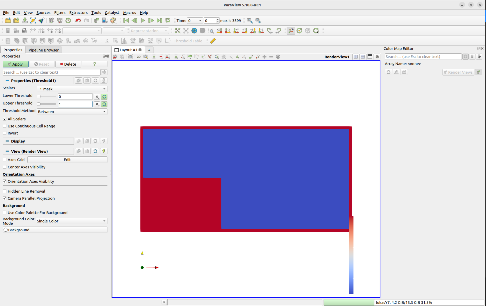

# NumSim
Project for the lecture Numerische Simulation at the University of Stuttgart. Details on the task can be found [here](https://numsim-exercises.readthedocs.io/en/latest/index.html).

## Requirements
* `gcc`
* `cmake`
* `libvtk`
* `libpng` 

## Run the simulation
We recommend to run the simulation using the provided bash script "build.sh". In that file enter the path of the settings file you would like to use. You can uncomment the doxygen part to build the documentation. Tests can be executed by uncommenting the run_test line

## Adjust the settings file
For the user there is the settings.txt file that can be adjusted to 
fit the specific simulation needs. 

The first part of the settings file specifies the general geometry 
of the simulation domain:

* **physicalSizeX** and **physicalSizeY**: The domain size in meters.
* **endTime**: The endtime of the simulation in seconds.
* **re**: The reynolds number (specfies indirectly the viscosity of the fluid).
* **gX** and **gY**: Acceleration resulting from external forces.

Subsequently the domain boundary conditions are specified. You can choose between Pressure and NoSlip.

* **BcTop**, **BcRight**, **BcBottom** and **BCLeft**: Type of boundary condition on either side of the domain. Can be either "NoSlip" or Pressure.

Then the specific values for the NoSlip domain boundary conditions follow.

* **NoSlipVelTopX/Y**: Noslip boundary velocities directly at the domain top in m/s.
* **NoSlipVelRightX/Y**: Noslip boundary velocities directly at the domain right in m/s.
* **NoSlipVelBottomX/Y**: Noslip boundary velocities directly at the domain bottom in m/s.
* **NoSlipVelLeftX/Y**: Noslip boundary velocities directly at the domain left in m/s.

Then the specific values for the Pressure domain boundary conditions follow.

* **PressureTop**: Pressure directly at the top of the domain in Pa
* **PressureRight**: Pressure directly at the right of the domain in Pa
* **PressureBottom**: Pressure directly at the bottom of the domain in Pa
* **PressureLeft**: Pressure directly at the left of the domain in Pa

If you want to put a rectangular object in the domain you can specfiy its location 
and dimension with the following setting.

* **createRectangularObject**: Set to true if you want to add a rectangular object
* **obstaclePositionX/Y**: Position of the left lower corner of the rectangle in the domain in m 
* **obstacleDimensionX/Y**: Dimension of the object in x and y direction in m

In the following you can specify wheter you want to load your domain from a bitmap.

* **createDomainfromBitmap**: Set to true if you want to load your domain from a bitmap

* **pathToBitmap**: path to the location of the bitmap saved as a png.

Then follows more paramters considering the discretization

* **nCellsX/Y**: Number of cells in x and y direction as int
* **useDonorCell**: Set to true if you want to use the Donor Cell scheme
* **alpha**: Factor for donor-cell scheme between 0 and 1. 0 is equivalent to central differences
* **epsilon**: Tolerance of the 2-norm residual 
* **maximumNumberOfIterations**: Maximum number of iterations of the pressure solver 

Finally a few parameters for open surfaces follow:

* **useFluidTracer**: Set to true if you want to simulate free surfaces
* **particlesPerCell**: Number of fluid particles per cell as integer

## Creating a domain using a bitmap
An easy way to introduce new obstacles into the domain, changing the domain 
geometry or adding air cells to the domain for free surfaces simulation is to use 
a bitmap. In gerneral you can use any program to create a bitmap however we recommend
[Pixilart](https://www.pixilart.com/). Here you can specify the number of pixels 
in x and y direction when creating a new bitmap. These pixel numbers directly correlate to the number of cells **inside** the simulation domain. Use the Bucket 
tool to fill your image with either white pixels (r:255, g:255, b:255) for air cells 
or blue pixels (any color apart from white and black actually works) for fluid cells.
Then use the drawing tool to add black obstacle cells (r:0, g:0, b:0). When saving 
the file, all pixels need to have a color value. If there are only black and white 
pixels you will essentially simulate an empty space, so always add colored pixels 
for fluid as well.

Safe the bitmap as a png, specify the path to that file in the settings.txt file 
and set **createDomainfromBitmap** to true. In the input/ bitmap folder you can find 
example files that you can simulate. 

## Display simulation results in ParaView
You can display your simulation results using ParaView. The necessary vtk files
will be written to the build/out folder during simulation. 

When the files are loaded into paraview you should apply a threshold to the mask 
field to make obstacle visible in paraview (see image). Then use the threshold field to perform further visualizations. 

## Contributors

* Lukas Harsch - [LHRaceIng](https://github.com/LHRaceIng)
* Arthur Lacerda Essel - [iatzak](https://github.com/iatzak)
* Jonathan Schnitzler - [Joni32do](https://github.com/Joni32do)
