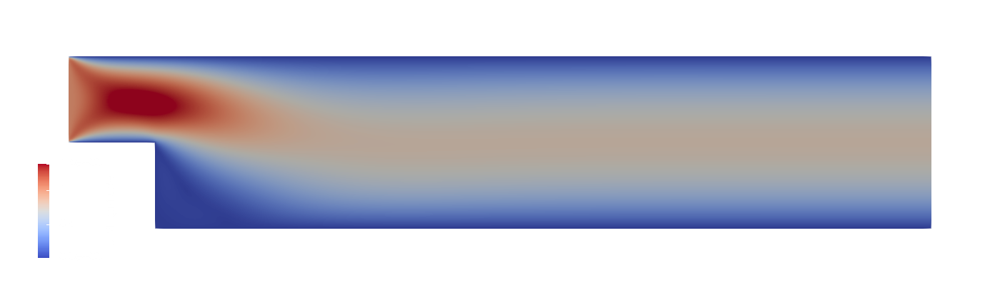
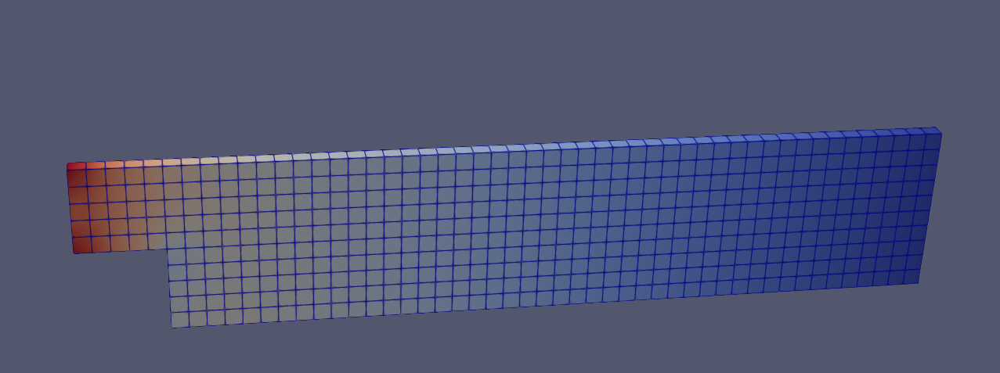

# OpenFOAM

This submission uses the tool *OpenFOAM* to generate different simulation scenarios

## Scenario 1: Lid Driven Cavity

This solves the lid driven cavity problem similar to the first submission in this lecture. This serves as a initial plausibilization with OpenFOAM.

## Scenario 2: Cavity with a Step

We inspect a different domain with an inflow and outflow condition at the left and right boundary, see following image

### Geometry

Therefore we need to define in `blockMeshDict` 8 vertices (with additional 8 vertices since in openFoam everything is 3D). 
Then the three blocks I, II and III are defined with these vertices. Similar the boundary faces are defined. On the left
there is an inflow BC and on the right there is a outflow BC. They are defined in the initial value file `0\p` and `0\U`.

#### Inflow
For `U` is of type `fixedValue` with value `uniform (1 0 0)` 
For `p` of type `zeroGradient`

#### Outflow
For `U` the type is `zeroGradient` 
For `p` of type `fixedValue` with value $0$

### Parameters

|parameter | value |
|----------|-------|
|deltaT    | 0.0005|
|write Interval | 20|
|solver    |icoFoam|

### Process

1. `blockMesh`
2. `icoFoam`
3. `paraFoam`

### Resolution

The problem was solved for different resolutions: 
* 1 Unit = 10 Nodes -> 225 Cells (upper left square I is 5x5)
* 1 Unit = 100 Nodes -> 22 500 Cells (upper left square I is 50x50)

### Results

#### Flow U

##### Start Value t = 0

<!--  -->

##### End Value t = 2 

#### Pressure p

#### Streamlines

#### Glyphs (Arrows)

#### Low resolution 3D vis

 

