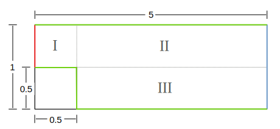
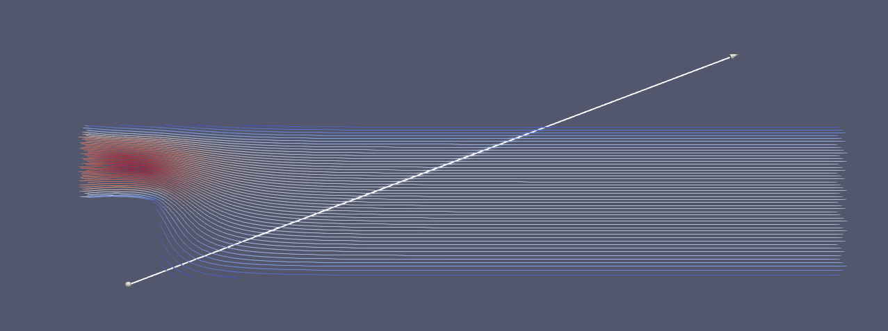

# OpenFOAM

This submission uses the tool *OpenFOAM* to generate different simulation scenarios

## Scenario 1: Lid Driven Cavity

This solves the lid driven cavity problem similar to the first submission in this lecture. This serves as a initial plausibilization with OpenFOAM.

## Scenario 2: Cavity with a Step

We inspect a different domain with an inflow and outflow condition at the left and right boundary, see following image

