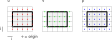

# Tests for the Domain of Discretization

## Array2d

### Constructor

### Getter

### Setter

### Special Values
* Nan
* Null
* double limits

## FieldVariable

## Staggered Grid

## Discretization

## DonorCell
As a grid we use

TODO:
Here I want to draw in the calculations I do in the test files (but Inkscape is striking in the moment)

## CentralDifferences